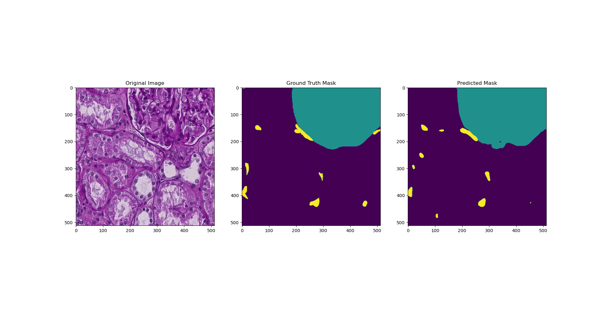

# HuBMAP
Hacking the Human Vasculature (Kaggle Competition)

## Submissions

### Release 1
The notebook should be runnable from start to finish on Kaggle's servers as long as you add the correct datasets to the environment.

Here are the specifications:
- UNet architecture
- Supervised learning, only
- 200 epochs of training
- Adam optimizer
- Batch normalization
- No weight decay (not AdamW)
- `3e-4` fixed learning rate
- 90-10 training-validation split
- Predicting 3 separate classes:
    - 0: background
    - 1: glomerulus
    - 2: blood vessel (target structure)
 
Results:
- Training loss decreased to near `0.0` but validation loss did not (overfitting!).
- Training mAP was hovering near `0.9` after 200 epochs (using my custom implementation).
- Validation mAP was `0.1815` after 200 epochs (using my custom implementation).
- Kaggle leaderboard mAP was `0.183` which got me 870th out of 1002 with 6 days left in the competition.

### Release 2
Not significantly better than Release 1

Here are the specifications:
- UNet architecture
- Supervised learning, only
- 300 epochs of training
- Adam optimizer
- Batch normalization
- No weight decay (not AdamW)
- `3e-4` fixed learning rate
- 90-10 training-validation split
- Predicting 3 separate classes:
    - 0: background
    - 1: glomerulus
    - 2: blood vessel (target structure)
- Data transformations
    - Flipping
    - Translation
    - Color Jitter

### Release 3

#### Baseline

- Validation IoU: 0.6747
- Training IoU: 0.7120
- Validation Loss: 1.326
- Training Loss: 0.01705

Here are the specifications:
- UNet architecture
- Supervised learning, only
- 200 epochs of training
- SGD optimizer
- Batch normalization
- Xavier initialization
- Dropout on final layer
- No weight decay
- Momentum at 0.95 (due to small batch size of 4)
- `0.1` to `1e-6` learning rate decay on a cosine annealing schedule (no restarts)
- 80-20 training-validation split
- Predicting 3 separate classes:
    - 0: background (purple)
    - 1: glomerulus (blue)
    - 2: blood vessel (yellow, target structure)

Here is a sample prediction on the validation set with an IoU of 0.806 (whole image, multi-class):

You can see that there are holes, smoothed edges, rough outlines, and some mispredictions. Elastic deformations of the image might help to solve some of these issues by allowing the network to be invariant to small changes in outline.
As for gaps, elastic deformations might help a bit but architectures better than UNet for this type of problem (YOLO, RCNN, etc.) will probably work better.

## Ideas
- UNet architecture
- Predict multiple masks (one for glomerulus and one for blood vessels)
    - Overlaps are possible (see image with ID `0870e4f9d580`) so we cannot exclude the glomerulus region
- When doing data transformations make sure to also apply them to the masks
    - If there is any randomness, we need to be able to control it so we can apply the same exact transform multiple times
- Use an ensemble to boost the final prediction
    - Maybe one UNet and one transformer?
    - Maybe just use dropout (doesn't work well with batch norm though)
- Scale the loss on unsure labels by setting the labeled regions to `0.5`
- A lot more unlabeled images than labeled ones.
    - Self-supervised or unsupervised pre-training followed by supervised fine-tuning
